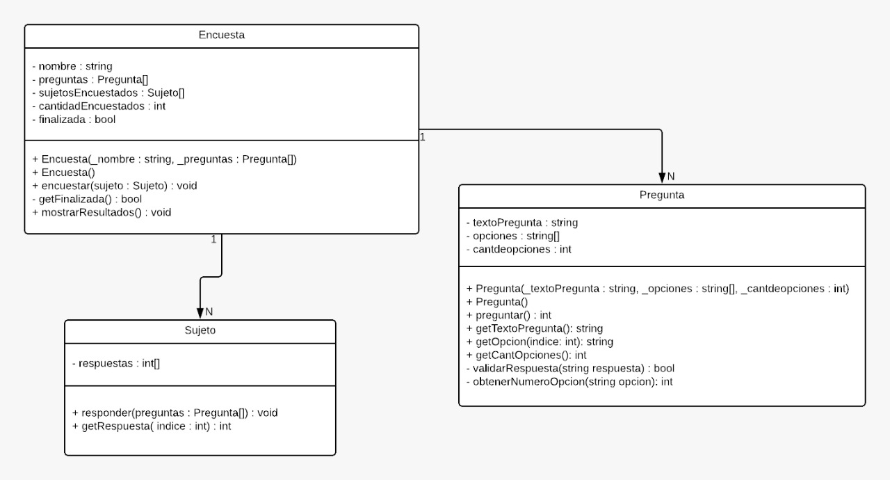

# Proyecto Encuesta

El objetivo del programa es poder llevar a cabo una encuesta y poder procesar los resultados, mostrándolos de manera ordenada.

## Diseño

Las clases del programa seguirán el siguiente esquema:

### Encuesta

Podemos ver que dentro de la clase **Encuesta** guardamos un array de **Sujeto** (_sujetosEncuestados_) y un array del tipo **Pregunta**, este atributo nos permite manejar una encuesta con todas sus preguntas necesarias.

Ademas contamos la cantidad se sujetos encuestados a través de la propiedad de tipo entero _cantidadSujetosEncuestados_.

El método **finalizada()** nos devuelve un bool, que nos va a indicar si la encuesta todavía puede _recibir_ mas sujetos para encuestar. Cuando **finalizada()** retorne _true_ la encuesta no podrá seguir realizando preguntas.

Para llamar al procedimiento **encuestar** debemos pasarle un **Sujeto**, el resultado, se guardara en el array **SujetosEncuestados** de la **Encuesta**..

### Sujeto

El procedimiento **encuestar** (de **Encuesta**) va a ejecutar **responder** del **Sujeto** pasandole como parámetro el array de **Pregunta**, los resultados (las respuestas) se guardaran en la propiedad **respuestas** del sujeto.

### Pregunta

Cada **Pregunta** cuenta con la propiedad **textoPregunta** del tipo string que va a reflejar el enunciado de la pregunta Ej: "_¿Cuál es su comida favorita?
_" y el atributo **opciones** va a ser un array de strings que va a mostrar las opciones disponibles de la pregunta Ej: "Pizza, Hamburguesa, Milanesa, Fideos, Pescado, Ensalada (cualquier tipo), Empanada, otra."

La función **preguntar()** va a mostrar por pantalla el texto de la pregunta y las opciones y leerá la respuesta del usuario, antes de devolver el resultado llamara a la función privada **validarRespuesta()** la cual devuelve un bool en true si la respuesta existe en las opciones o false si no existe.

## Flujo

Mirando desde el `main` el flujo seria algo asi:

